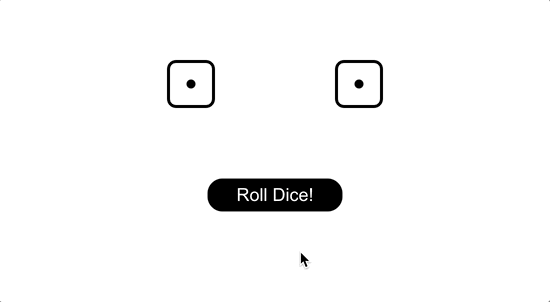

# React State Dice Exercise

This app lets us roll a pair of dice by clicking the button. The button changes its text dynamically and becomes disabled (un-clickable) until the dice rolling animation has completed.

## 🎉 Demo 




## ✨ What I Have Learned

React **state** is designed to constantly change in response to events. To initialize state, refer to `this.state()` inside the constructor of the component. To change the state, use the built-in React method `setState()`. It schedules an update to a component’s state object. When state changes, the component responds by re-rendering.

In React, every JSX element has built-in attributes representing every kind of browser event. They are camel-cased, like `onClick`, and take callback functions as event listeners. The callback needs to be binded with the component to avoid its `this` keyword being undefined.

**Props** and **state** are both plain JavaScript objects. While both hold information that influences the output of render, they are different in one important way: props get passed to the component (similar to function parameters) whereas state is managed within the component (similar to variables declared within a function).


## 💻 Setup

1️⃣ Run the command below to install packages used in the project:
```sh

$ npm install

```
2️⃣ Move into the React project:
```sh
$ cd react-state-dice

```

3️⃣ Run `npm start` in the terminal to start the server, and the application will automatically open up on `http//localhost:3000` in the web browser.


## 👏 Credits

This project is based on the React state tutorial of <a href="https://www.udemy.com/course/modern-react-bootcamp/">The Modern React Bootcamp</a> by Colt Steele.

The dice icons are imported from <a href="https://react-icons.github.io/react-icons">React Icons</a>.
